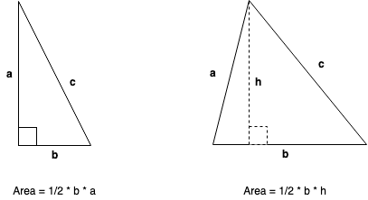
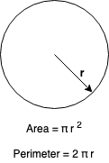

# Lesson 2 Homework Solutions:

* The perimter of an object is the distance around that object.
* The area of an object is the space it occupies.

## Rectangles

* Perimeter = a + b + a + b = 2a + 2b = 2(a+b)
* Area = a x b

## Squares

* Perimeter = a + a + a + a = 4a
* Area = a x a = a2.

## Triangles

* Perimeter = a + b + c
* Area = 1/2 x base x height

## Circle

* _r_ is the radius of the circle
* Perimeter = 2 x π x r 
* Area = π x r2
