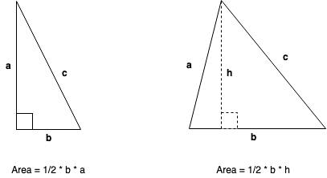

# Lesson 2 Homework Solutions:

* The perimter of an object is the distance around that object.
* The area of an object is the space it occupies.

## Rectangles

* Perimeter = a + b + a + b = 2a + 2b = 2(a+b)
* Area = a x b
* [rectangle.py](rectangle.py)
~~~~python
print ("\nRectangle Calclulations:")
print ("========================")
w = input("Enter width(w): ")
l = input("Enter length(l): ")
a = int(w) * int(l)
p = int(w) + int(l) + int(w) + int(l)
print ("Area is: ", a)
print ("Perimiter is: ", p)
print ()
~~~~

## Squares

* Perimeter = a + a + a + a = 4a
* Area = a x a = a2.
* [square.py](square.py)
~~~~python
print ("\nSquare Calclulations:")
print ("========================")
w = input("Enter width(w) of one side: ")
a = int(w) * int(w)
p = int(w) + int(w) + int(w) + int(w)
print ("Area is: ", a)
print ("Perimiter is: ", p)
print ()
~~~~

## Triangles

* Perimeter = a + b + c
* Area = 1/2 x base x height
* [triangle-area.py](triangle-area.py)
~~~~python
print ("\nTriangle Perimeter:")
print ("========================")
a = input("Enter side(a): ")
b = input("Enter side(b): ")
c = input("Enter side(c): ")
p = int(a) + int(b) + int(c)
print ("Perimiter is: ", p)
print ()
~~~~
* [triangle-perimeter.py](triangle-perimeter.py)
~~~~python
print ("\nTriangle Perimeter:")
print ("========================")
a = input("Enter side(a): ")
b = input("Enter side(b): ")
c = input("Enter side(c): ")
p = int(a) + int(b) + int(c)
print ("Perimiter is: ", p)
print ()
~~~~

## Circle

* _r_ is the radius of the circle
* Perimeter = 2 x π x r 
* Area = π x r2
* [circle.py](circle.py)
~~~~python
print ("\nCircle Calclulations:")
print ("========================")
r = input("Enter radius(r) of the circle: ")
r = int(r)
pi = 22/7.0
a = pi * r * r
p = 2 * pi * r
d = 2 * r
print ("Area is: ", a)
print ("Perimiter is: ", p)
print ("Diameter is: ", d)
print ()
~~~~

## Temperature conversion
* farenheit = (celsius * 9/5)+32
* celsius = (farenheit - 32) * 5/9
* [cel2far.py](cel2far.py)
~~~~python
print ("\nCelsius to Farenheit:")
print ("========================")
t = input("Enter temperature in degrees celsius: ")
t = int(t)

f = (t*9/5.0)+32

print ("Temperature in Farenheit is:  ",f)
print ()
~~~~
* [far2cel.py](far2cel.py)
~~~~python
print ("\nFarenheit to Celsius:")
print ("========================")
t = input("Enter temperature in degrees farenheit: ")
t = int(t)

c = (t-32)*(5.0/9)

print ("Temperature in Celsius is:  ",c)
print ()
~~~~
